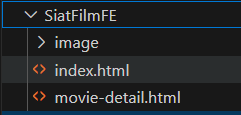

# Aplikasi STREAMING FILM

JarsFilm adalah platform web streaming yang dikembangkan untuk memenuhi persyaratan pre-test bagi programmer junior di SIAT-DEV Diskominfo dan Sandi Prov. Aceh pada tahun 2025. Platform ini didukung oleh solusi backend yang kuat yang dikembangkan oleh faJars.

## Persyaratan

Pastikan Anda memiliki perangkat lunak berikut sebelum memulai:

- [PHP](https://www.php.net/) >= 8.x
- [Composer](https://getcomposer.org/)
- [MySQL](https://www.mysql.com/) atau database lain yang sesuai

## Langkah-langkah untuk Menjalankan Aplikasi

### 1. Clone repositori

Pertama, clone repositori ini ke dalam direktori lokal:

```bash
git clone https://github.com/fajarsyaa/SiatDevFilmPreTest.git
cd repository-name
```

Setelah berhasil clone dan masuk ke direcetori yang benar, masuk ke dalam folder SiatFilmBE dengan cara dibawah ini, kemudian jalankan semua perintah yang tertulis.
```bash
cd SiatFilmBE
composer install
php artisan key:generate
php artisan storage:link
php artisan migrate
php artisan db:seed
php artisan serve
```

setelah SiatFilmBE berhasil dirunning, maka masuk ke dalam folder SiatFilmFE dan klik 2x pada file index.html kemudian pilih browser pilihan anda, atau klik kanan pada file index.html kemudian pilih "open with" pilih browser anda


